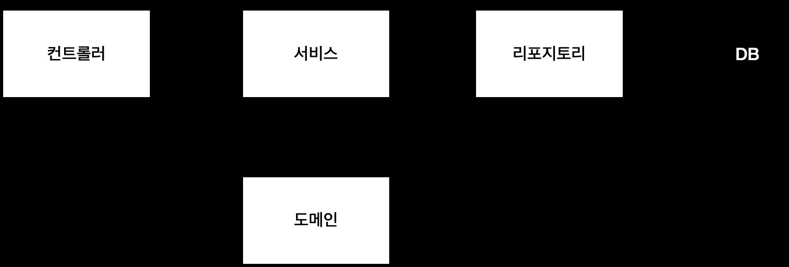

# Week2 (섹션4)

## 회원 관리 예제

### 일반적인 웹 애플리케이션 계층 구조

- 컨트롤러 : 웹 MVC의 컨트롤러 역할
- 서비스 : 핵심 비즈니스 로직 구현
- 리포지토리 : 데이터베이스에 접근,  도메인 객체를 DB에 저장하고 관리
- 도메인 : 비즈니스 도메인 객체 ex) 회원, 주문, 쿠폰 등등 주로 데이터 베이스에 저장하고 관리됨

### 테스트 케이스 작성

개발한 기능을 실행해서 테스트 할 때 자바의 main 메서드를 통해서 실행하거나, 웹 애플리케이션의 컨트롤러를 통해서 해당 기능을 실행한다. 

이러한 방법은 준비하고 실행하는데 오래 걸리고, 반복 실행하기 어렵고 여러 테스트를 한번에 실행하기 어렵다는 단점이 있다. 

→ 자바는 JUnit이라는 프레임워크로 테스트를 실행해서 이러한 문제를 해결한다

한번에 여러 테스트를 실행하면 메모리 DB에 직전 테스트의 결과가 남을 수 있다. 

→ 이전 테스트 때문에 다음 테스트가 실패할 가능성이 있다. 

→ 테스트는 각각 독립적으로 실행되어야 한다. 테스트 순서에 의존관계가 있는 것은 순서를 보장하지 못할 상황이 생기기 때문에 좋은 테스트가 아니다.

 

@AfterEach를 사용하면 각 테스트가 종료
될 때 마다 이 기능을 실행한다. 여기서는 메모리 DB에 저장된 데이터를 삭제한다.

@BeforeEach 각 테스트 실행 전에 호출된다. 테스트가 서로 영향이 없도록 항상 새로운 객체를 생성하고, 의존관계도 새로 맺어준다.