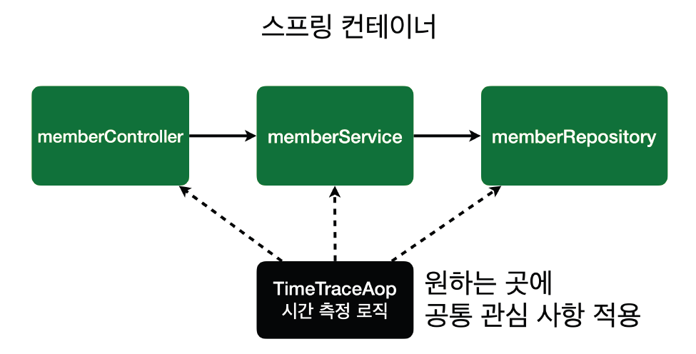

# Week 8

# AOP(Aspect-Oriented Programming)

프로그램의 핵심 비즈니스 로직과는 별개로 공통적으로 필요한 기능을 분리하여 관리하는 방법이다. 

공통 기능을 예로 들자면, 로그기록, 권한 검사, 트랜잭션 관리, 예외 처리 등이 있다.

→ AOP를 통해 개발자는 핵심 기능과 공통 기능을 분리할 수 있어서 코드의 가독성과 유지보수성을 향상 시킬 수 있다.

→ 공통 관심 사항(cross-cutting concern) vs 핵심 관심 사항(core concern)

### AOP가 필요한 상황

: 모든 메소드의 호출 시간을 측정하고 싶다면?

회원 가입 시간, 회원 조회 시간을 측정하고 싶다면?

회원가입, 회원 조회에 시간을 측정하는 기능은 핵심 관심 사항이 아니다. 

그런데 시간을 측정하는 로직은 공통 관심 사항이다. 시간을 측정하는 로직과 핵심 비즈니스의 로직이 섞여서 유지보수가 어려우며, 시간을 측정하는 로직을 별도의 공통 로직으로 만들기 매우 어렵다.

→ 시간을 측정하는 로직을 변경할 때 모든 로직을 찾아가면서 변경해야한다.

### AOP 적용



```jsx
// 시간 측정 AOP 등록
package hello.hellospring.aop;

import org.aspectj.lang.ProceedingJoinPoint;
import org.aspectj.lang.annotation.Around;
import org.aspectj.lang.annotation.Aspect;
import org.springframework.stereotype.Component;

// 이 클래스를 스프링 빈으로 등록하여 AOP 기능을 활성화하기 위해 @Component 어노테이션을 사용
@Component
// 이 클래스가 AOP 기능을 담당하는 Aspect 클래스임을 명시하기 위해 @Aspect 어노테이션을 사용
@Aspect
public class TimeTraceAop {

	// @Around 어노테이션은 메소드 실행 전후에 특정 동작을 수행할 수 있게 해준다.
	// 포인트컷(Pointcut) 표현식을 지정하여 AOP 적용 대상 메소드를 설정할 수 있다.
	// "execution(* hello.hellospring..*(..))"은 hello.hellospring 패키지 및 하위 패키지의 모든 메소드를 대상으로 한다.
	@Around("execution(* hello.hellospring..*(..))")
	public Object execute(ProceedingJoinPoint joinPoint) throws Throwable {
		// 메소드 시작 시간을 기록
		long start = System.currentTimeMillis();
		// 메소드 실행 전 로그 출력
		System.out.println("START: " + joinPoint.toString());

		try {
			// 대상 메소드 실행 (joinPoint.proceed()를 호출해야 실제 타겟 메소드가 수행됨)
			return joinPoint.proceed();
		} finally {
			// 메소드 종료 시간을 기록하고, 실행 시간(밀리초 단위)을 계산
			long finish = System.currentTimeMillis();
			long timeMs = finish - start;
			// 메소드 종료 후 로그 출력, 소요 시간 포함
			System.out.println("END: " + joinPoint.toString() + " " + timeMs + "ms");
		}
	}
}

```

- **`@Around` 어노테이션**: AOP가 적용될 메소드의 실행 전후로 동작을 정의하는 어노테이션입니다. `execution(* hello.hellospring..*(..))`이라는 표현식은 `hello.hellospring` 패키지와 그 하위 패키지의 모든 메소드에 AOP를 적용합니다.
- **`ProceedingJoinPoint` 매개변수**: `ProceedingJoinPoint`는 현재 실행 중인 메소드에 대한 정보를 담고 있으며, `proceed()` 메소드를 호출하여 대상 메소드를 실제로 실행합니다.
- **시간 측정 로직**:
    - **`start` 변수**: 메소드 시작 시간을 `System.currentTimeMillis()`로 기록합니다.
    - **`proceed()` 호출**: 대상 메소드가 실행됩니다.
    - **`finish` 및 `timeMs` 계산**: 메소드 종료 시간을 기록하고 소요 시간(`finish - start`)을 계산합니다.
- **로그 출력**: 시작과 종료 시점에 메소드 정보 및 소요 시간을 로그로 출력하여 시간 측정 결과를 확인할 수 있습니다.

이러한 방식으로 `TimeTraceAop` 클래스는 대상 메소드의 실행 시간을 자동으로 측정해주며, 핵심 비즈니스 로직에 영향을 주지 않고 횡단 관심사(시간 측정 로직)를 분리해줍니다.

→ 회원가입, 회원 조회등 핵심 관심사항과 시간을 측정하는 공통 관심 사항을 분리한다.
시간을 측정하는 로직을 별도의 공통 로직으로 만들었다.
핵심 관심 사항을 깔끔하게 유지할 수 있다.
변경이 필요하면 이 로직만 변경하면 된다.
원하는 적용 대상을 선택할 수 있다.

### 스프링의 AOP 동작 방식 설명

