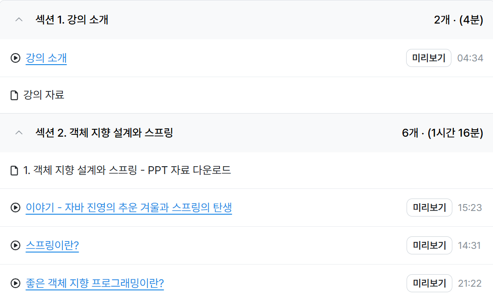

# Week 9

스프링 핵심 원리 - 기본편

### 강의 목차

1. 객체 지향 설계와 스프링
2. 스프링 핵심 원리 이해 1 - 예제 만들기
3. 스프링 핵심 원리 이해2 - 객체 지향 원리 적용
4. 스프링 컨테이너와 스프링 빈
5. 싱글톤 컨테이너
6. 컴포넌트 스캔
7. 의존관계 자동 주입
8. 빈 생명주기 콜백
9. 빈 스코프

### 스프링의 역사

- **JPA(표준 인터페이스)**: 다이어그램의 최상단에 위치하며, JPA는 Java에서 객체와 관계형 데이터베이스 간의 매핑을 표준화한 API
- **JPA 구현체들**: JPA를 구현하는 다양한 라이브러리
- **하이버네이트(Hibernate)**: 널리 사용되는 JPA의 대표적인 구현체
- **EclipseLink**: Oracle에서 지원하는 JPA 구현체
- **기타...**: 그 외 다른 JPA 구현체들

스프링 부트

- 스프링을 편리하게 사용할 수 있도록 지원하며, 최근에는 기본으로 사용한다.
- 단독으로 실행할 수 있는 스프링 애플리케이션을 쉽게 생성하고 Tomcat같은 웹 서버를 내장하여 별도의 웹 서버를 설치하지 않아도 된다.
- 손쉬운 빌드 구성을 위한 starter 종속성을 제공한다.
- 스프링과 3rd parth(외부) 라이브러리 자동으로 구성한다.
- 메트릭, 상태확인, 외부 구성 같은 프로덕션 준비 기능을 제공한다.

### 스프링

- 스프링이라는 단어는 문맥에 따라 다르게 사용된다.
- "스프링"은 단순히 하나의 기술이나 프레임워크를 지칭하지 않고, 기술적 맥락에 따라 다양한 의미를 가질 수 있다.

- **스프링 DI 컨테이너 기술**: 스프링의 의존성 주입(Dependency Injection)과 관련된 핵심 기술.
- **스프링 프레임워크**: 스프링의 대표적인 모듈로, 다양한 애플리케이션 개발에 활용되는 프레임워크.
- **스프링 생태계**: 스프링 부트(Spring Boot), 스프링 프레임워크 등을 포함한 전체적인 스프링 관련 기술 및 도구들.

스프링을 왜 만들었을까?

이건 핵심이 아니다.

이게 핵심이다.

좋은 객체지향프로그램이란??

사실 스프링 컨테이너가 제공하는 다형성을 편리하게 사용할 수 있도록 지원하는 기능이다.

객체 지향 설계에 대해서 제대로 알려면 다형성 말고도 좋은 객체 지향 설계의 원칙 (SOLID)를 알고 있어야 한다. → 면접에도 자주 나옴.